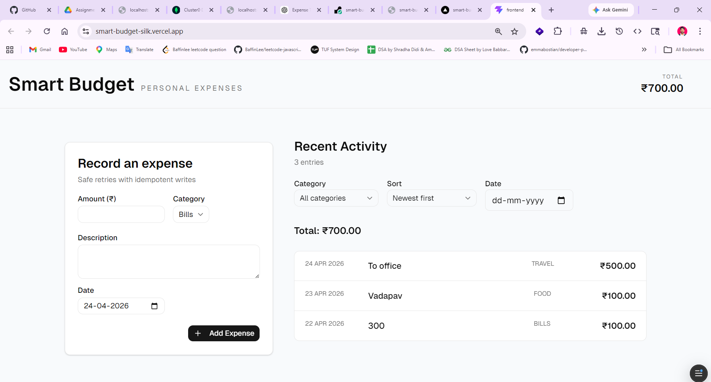

# Smart Budget

Smart Budget is a minimal full-stack expense tracker built to record and review personal expenses under realistic conditions such as retries, slow responses, and browser refreshes.

It allows users to:

- Create a new expense
- View expense history
- Filter by category
- Sort by date
- See total visible expenses

---

# Live Demo
<p align="center">
  
</p>

Frontend: https://smart-budget-silk.vercel.app/  
Backend API: https://smart-budget-32gk.onrender.com/health

---

# Tech Stack

## Frontend
- React + Vite
- shadcn/ui
- Tailwind CSS
- Axios
- React Router DOM

## Backend
- Node.js
- Express.js
- MongoDB + Mongoose

## Deployment
- Frontend: Vercel
- Backend: Render
- Database: MongoDB Atlas

---

# Project Structure

```
smart-budget/

├── frontend/
│   ├── src/
│   ├── components/
│   ├── pages/
│   ├── api/
│   └── lib/
│
├── backend/
│   ├── src/
│   ├── controllers/
│   ├── routes/
│   ├── models/
│   └── middleware/
```
---

# Key Design Decisions

## 1. Idempotent Expense Creation

The backend accepts an `Idempotency-Key` header for expense creation.

This prevents duplicate expenses when:
- users click submit multiple times
- browser retries requests
- network delays occur

If the same request is retried with the same key, the existing expense is returned instead of creating a duplicate.

---

## 2. Money Stored as Integer Paise

Expense amounts are stored as integer paise instead of floating-point rupees.

Example:

₹500.00 → 50000

This avoids floating-point rounding errors and keeps money calculations reliable.

---

## 3. Backend Filtering and Sorting

Filtering and sorting are handled on the backend:

GET /expenses?category=Food&sort=date_desc

This keeps frontend logic simple and allows easy future scalability.

---

## 4. Frontend Defensive UX

The frontend prevents accidental duplicate actions by:

- disabling submit button during requests
- showing loading state
- preserving idempotency key until success

---

## 5. Component-Based Frontend Structure

UI is split into focused reusable components:

- ExpenseForm
- ExpenseList
- TotalBar
- Navbar

This keeps maintenance simple.

---

# Trade-offs Due to Timebox

To keep scope realistic, the following trade-offs were made:

- Authentication was not added
- Expense editing/deletion was not implemented
- Categories are currently static in frontend
- Pagination was omitted because list size is small

Priority was given to correctness, reliability, and clean structure over feature breadth.

---

# Intentionally Not Done

The following were intentionally excluded:

- Multi-user support
- Analytics dashboard
- Export to CSV / reports
- Advanced category management UI

These are natural future extensions but not required for the core assignment.

---

# What Matters Most in This Implementation

This project prioritizes:

- Correct behavior under retries and refreshes
- Safe money handling
- Clear backend structure
- Simple maintainable frontend

The goal was production-like correctness rather than feature completeness.

---

# Running Locally

## Frontend

cd frontend  
npm install  
npm run dev

## Backend

cd backend  
npm install  
npm run dev

---

# Future Improvements

- Dynamic categories from backend
- Create for many users
- Expense editing
- Better reporting dashboard
- Test coverage
- CI/CD pipeline